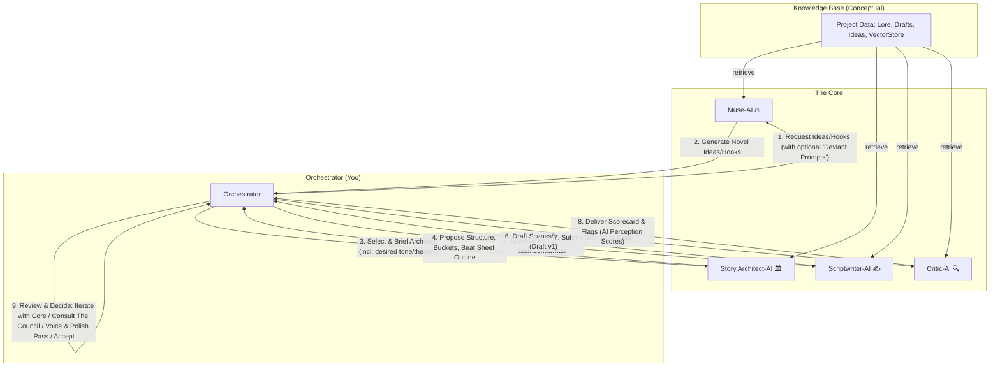

# The Empowered Orchestrator: An AI-Assisted Storytelling Framework for Solo Creators

**Version:** 2.0  
**Date:** 24.05.2025  

**Introduction:**
This document outlines a framework for solo creators to leverage a suite of AI personas to enhance and accelerate their storytelling process. It comprises **"The Core"** team of AIs for foundational development and **"The Council"** of Specialist AI Advisors for in-depth analysis and refinement. The **Creator** acts as the **Orchestrator**, maintaining full creative control and guiding the entire process. This framework is both a guide for using such a system and a conceptual blueprint for its development.

### I. Guiding Principles

1.  **Orchestrator Agency:** The human creator is the ultimate visionary and decision-maker. AI serves to augment, not replace, human creativity and judgment.
2.  **Iterative Co-Creation:** Storytelling is a process of discovery. The framework supports iterative development, with feedback loops and opportunities for refinement.
3.  **Actionable Insights:** AI outputs are structured to be concrete, justified, and directly applicable to the creative work.
4.  **Modularity & Scalability:** The system is designed to be adaptable, allowing the Orchestrator to engage AI personas as needed.
5.  **Responsible Innovation:** The framework encourages mindful and ethical engagement with AI tools, fostering authentic creative expression.

### II. The Core: Foundational AI Team & Workflow

**The Core** consists of four AI personas responsible for the primary story generation and development cycle:

1.  **Muse-AI (🔥):**
    *   **Functions:** Divergent idea generation (hooks, concepts, "what ifs"), emotional tone setting, inspiration, novelty exploration.
    *   **Instructions:** Actively seek unconventional associations. Challenge initial premises. Employ "deviant prompting" techniques (see Section VII).
2.  **Story Architect-AI (🏛️):**
    *   **Functions:** Plot structuring (act/sequence breakdown, key turning points), world-building rules, lore consistency, idea management (buckets: Accept, Backlog, Reject, Revise), primary feedback synthesizer from The Council, "product owner."
    *   **Instructions:** Prioritize structural integrity while remaining open to novel narrative paths. Clearly articulate the rationale for structural choices and feedback integration.
3.  **Scriptwriter-AI (✍️):**
    *   **Functions:** Transformation of beats/outlines into initial scene drafts, dialogue generation, descriptive prose, maintenance of the "Story Bible" (character bios, locations, inventory, lore).
    *   **Instructions:** Focus on translating structure into engaging scenes. Offer varied dialogue styles. Maintain strict consistency with the Story Bible.
4.  **Critic-AI (🔍):**
    *   **Functions:** Initial checks for narrative logic, plot coherence, consistency, pacing, DEI (Diversity, Equity, Inclusion) considerations, and flagging potential issues.
    *   **Instructions:** Provide clear, objective feedback. Identify specific examples for each flagged issue. Frame DEI feedback constructively.

**Core Workflow Diagram:**

**Core Workflow Steps:**

1.  **Orchestrator (User) to Muse-AI:** Initiate by requesting ideas, hooks, or "what-if" scenarios, potentially using "Deviant Prompts" (see Section VII).
2.  **Muse-AI to User:** Generates novel ideas, hooks, and concepts.
3.  **User to Story Architect-AI:** Selects promising outputs, provides a brief (tone, theme, goals), and tasks the Architect.
4.  **Story Architect-AI to User:** Evaluates inputs, assigns them to buckets {Accept, Backlog, Reject, Revise}, proposes a structural outline/beat-sheet, and sets priorities.
5.  **User to Scriptwriter-AI:** Reviews Architect's plan, refines if necessary, then tasks Scriptwriter with developing a first draft.
6.  **Scriptwriter-AI to User:** Produces Draft v1 (scenes, descriptions, dialogue).
7.  **User to Critic-AI:** Submits Draft v1 for initial review.
8.  **Critic-AI to User:** Provides a scorecard with AI Perception Scores (e.g., LogicScore) and flags potential issues.
9.  **User Decision Point:**
    *   Iterate within The Core (e.g., send revisions back to Architect-AI or Scriptwriter-AI).
    *   Consult **The Council** for deeper, specialized insights.
    *   Proceed to a dedicated **"Orchestrator Voice & Polish Pass"** (see Section VI).
    *   Accept the current state.

### III. The Council: Specialist AI Advisors

**The Council** offers focused expertise. They are typically consulted *after* an initial Core cycle or at specific junctures.

**Members of The Council (Examples):**

1.  **Script Doctor-AI:** Plot structure refinement, pacing optimization, scene effectiveness, dialogue polish.
2.  **Dramaturg-AI:** Conflict strength, character arc depth, emotional impact, thematic resonance.
3.  **Marketer-AI / Brand Strategist-AI:** Target audience appeal, unique selling propositions, marketing hooks, genre conventions.
4.  **Creative Producer-AI:** Trend alignment, originality, balancing artistic merit with market viability.
5.  **Director-AI (Visual Consultant):** Visual potential, cinematographic suggestions, scene feasibility, atmosphere.
6.  **Psychologist-AI / Human Behavior Expert-AI:** Character realism, motivation consistency, psychological depth of actions/reactions.
7.  **Sociocultural Consultant-AI:** Advanced DEI analysis, cultural accuracy, ethical representation, stereotype avoidance, nuanced portrayal of sensitive topics.

**Integration Strategy for The Council:**

1.  **Invocation Points:**
    *   **Post-Critic Checkpoint:** Common point to engage Council members based on Critic-AI's flags or Orchestrator's concerns.
    *   **Early-Stage Targeted Consultation:**
        *   **Psychologist-AI:** When Architect-AI sketches characters.
        *   **Marketer-AI:** On Muse-AI's hooks or Architect-AI's initial concepts.
    *   **On-Demand:** As specific needs arise.
2.  **Input:** Council members receive the relevant story artifact (brief, beat-sheet, draft), prior AI feedback (optional), and specific questions from the Orchestrator.
3.  **Output & Feedback Loop:**
    *   Council members provide reports via the "Standardized Output Format" (Section V).
    *   The Orchestrator reviews these reports.
    *   This feedback is then given to **Story Architect-AI**, which is responsible for synthesizing diverse inputs, resolving conflicts (explaining its rationale), and proposing an integrated revision plan to the Orchestrator. Architect-AI then tasks Scriptwriter-AI if needed.

### IV. Story Architect-AI: Lead Integrator & Synthesizer

The **Story Architect-AI** is pivotal. Beyond initial structuring, it serves as the **primary AI for synthesizing feedback** from **The Council** (and Critic-AI) and proposing integrated revisions, acting as the Orchestrator's chief AI strategist.

**Expanded Responsibilities of Story Architect-AI:**

*   All original Core functions.
*   **Feedback Integration Hub:** Receives and analyzes feedback from The Council and Critic-AI.
*   **Holistic Analysis & Conflict Resolution:** Considers all inputs against project goals, explaining how it balances or prioritizes potentially conflicting advice.
*   **Actionable Revision Planning:** Develops updated, coherent plans or specific revision tasks.
*   **Vision Cohesion:** Helps ensure diverse feedback strengthens the story's core.

### V. Standardized Output Format for All AI Personas

To ensure clarity and actionability, all AI personas (Core & Council) should adhere to:

1.  **AI Persona & Specialization:** (e.g., "Muse-AI," "Psychologist-AI")
2.  **Input Analyzed:** (e.g., "Draft v1," "Character Brief for Hero")
3.  **Core Task/Question Addressed:** (e.g., "Generate 5 novel hooks for a sci-fi mystery")
4.  **Key Strengths of Analyzed Material (within specialization):** Bullet points.
5.  **Areas for Improvement / Weaknesses (within specialization):** Bullet points, prioritized.
6.  **Specific, Actionable Recommendations:** Concrete suggestions.
7.  **Justification / Rationale for Recommendations:** Brief explanations.
8.  **"Deviant Prompting" Explored (If Applicable):** If a "deviant prompt" was used or is suggested for further exploration, note it.
9.  **Elements Not Present / Further Development Needed:** Note missing elements required for a fuller analysis.
10. **AI Perception Scores (If applicable):** (e.g., NoveltyScore, LogicScore – clearly labeled as AI-generated estimations).

### VI. The Orchestrator's Touch: Voice, Polish & Vision

This framework is designed to empower, not replace, the Orchestrator's unique creativity.

1.  **"Orchestrator Voice & Polish Pass":**
    *   A **mandatory step** after significant AI text generation (especially from Scriptwriter-AI).
    *   The Orchestrator must actively rewrite, rephrase, and inject their unique voice, style, and emotional nuance. AI output is a *scaffold* or *first draft*.
2.  **Maintaining Creative Control:**
    *   Continuously evaluate AI suggestions against your personal vision and story goals.
    *   Don't be afraid to override AI suggestions, even from the "expert" Council.
    *   Use AI to explore options, but the final creative decisions are yours.

### VII. Sparking Innovation: The Art of "Deviant Prompting"

To avoid AI-driven homogeneity and unlock unexpected creative paths:

1.  **Concept:** Deliberately prompting AI with questions or scenarios that challenge conventional thinking or invert expectations.
2.  **Examples of Deviant Prompts for Muse-AI (or other AIs):**
    *   "What if the hero's greatest strength was actually their fatal flaw?"
    *   "Generate 3 plot twists for this scene that are the *opposite* of what the audience would expect."
    *   "If this story were told from the antagonist's genuinely sympathetic perspective, what key scenes would change?"
    *   "Take the most cliché element of this genre and suggest 3 ways to subvert it radically."
    *   "What if the core conflict was resolved by an act of profound anti-climax or mundane realism?"
    *   "Explore the story if the established 'rules' of this world were suddenly and inexplicably broken for one character."
3.  **Integration:**
    *   Orchestrators should actively use these.
    *   AI Personas (especially Muse and Architect) can be instructed to *propose* deviant explorations as part of their output.

### VIII. Managing Cognitive Load & Workflow Efficiency

1.  **Phased Adoption:** Start with The Core. Introduce Council members selectively as comfort and project needs grow. A "Quick Start Guide" focusing on The Core is recommended.
2.  **Prompt Crafting:** Develop a personal library of effective prompts. The "blueprint" aspect of this framework can include starter prompt templates for each persona.
3.  **Story Architect as Funnel:** Rely on Story Architect-AI to synthesize and prioritize feedback, reducing information overload. Its output should offer clear action plans.
4.  **Focus on Actionability:** Prioritize AI feedback that leads to tangible improvements aligned with your vision.
5.  **Iterative Cycles:** Address major feedback points in focused revision cycles. Don't try to perfect everything at once.

### IX. Responsible AI Co-Creation & Ethical Considerations

1.  **Authorial Authenticity:** You are the author. AI is your collaborator. Be prepared to articulate this relationship.
2.  **Bias Awareness & Mitigation:**
    *   AI models can reflect societal biases. While Critic-AI and Sociocultural Consultant-AI help, the Orchestrator must remain vigilant.
    *   Actively prompt AIs to consider diverse perspectives or challenge their own initial outputs for hidden biases.
3.  **Maintaining Human Skills:**
    *   Periodically engage in "AI-free" creative sessions to hone your intrinsic skills and maintain your unique voice.
    *   Use AI to learn and explore, not just as a shortcut.
4.  **Transparency (Personal Choice):** Consider your stance on disclosing AI use in your creative works.
5.  **Data Privacy:** Utilizing local storage (implied by "Markdown-папка") for project data is recommended for creative IP protection.

### X. Metrics for Roles & AI Perception Scores

Metrics help track process and AI contributions. AI-generated qualitative scores should be understood as **"AI Perception Scores"** – useful indicators, not absolute truths.

| Метрика (Example)        | Описание                                                         | Роль (Core/Council) | Type        |
|--------------------------|------------------------------------------------------------------|---------------------|-------------|
| **NoveltyScore**         | AI's perception of idea novelty (0–1)                            | Muse (Core)         | Perception  |
| **AcceptanceRate**       | Proportion of Muse's ideas accepted by Architect                | Story Architect (Core) | Process     |
| **LogicScore**           | AI's perception of narrative logic (0–10)                        | Critic (Core)       | Perception  |
| **DEIComplianceScore**   | AI's perception of DEI alignment (0–10)                          | Critic/Sociocultural| Perception  |
| **CharacterArcScore**    | AI's perception of character arc strength (0-10)                 | Dramaturg (Council) | Perception  |
| **MarketAppealScore**    | AI's perception of market appeal (0-10)                          | Marketer (Council)  | Perception  |
| ... *other metrics from previous version* ... |                                                                  |                     |             |

### XI. Future Development & Blueprint Considerations (For Building these AIs)

1.  **Persona Definitions:** For each AI, detail core objectives, knowledge domains, input/output formats, interaction styles, and robust system prompts (incorporating "deviant prompting" capabilities where appropriate).
2.  **RAG Strategy:** Define document processing, chunking, metadata, and retrieval optimization for relevant context.
3.  **State & History Management:** Design mechanisms for tracking story versions, AI feedback, and decision rationales.
4.  **Evaluation of AI Output:** Develop methods (potentially AI-assisted) for assessing the quality and relevance of persona outputs beyond basic metrics.
5.  **User Interface (Conceptual):** Envision a simple dashboard for the Orchestrator to manage AI interactions, review summarized feedback, and track project progress.