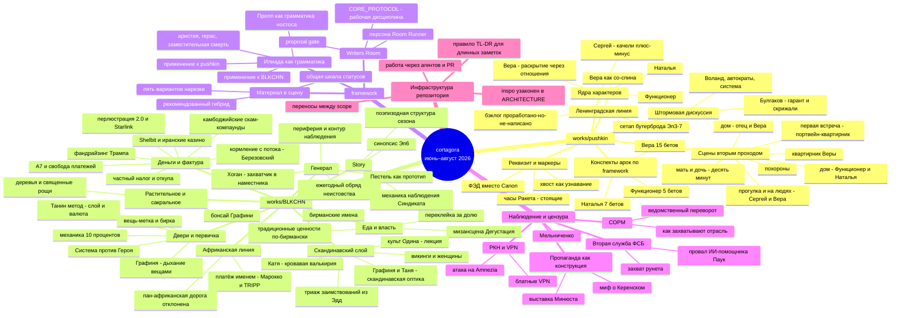

# Карта тем: июнь — август 2026

Окно: **2026-06-04 → 2026-08-04**. Источник — история `trunk`: 167 не-merge коммитов, 107 затронутых файлов, 83 новых. Распределение по месяцам: июнь — 9 коммитов (только захват материала), июль — 158, август — 28 (по 3 августа).

Карта описывает **что обсуждалось и разрабатывалось**, а не что зафиксировано как канон. Ничего отсюда не является каноном.

## TL;DR

- Основной объём работы — `works/pushkin` (94 касания файлов) и `works/BLKCHN` (около 85).
- Июнь — почти пустой: несколько клиппингов. Вся разработка приходится на июль и первые дни августа.
- Три надпроектных рамки появились или переписаны за окно: «Илиада» как нарративная грамматика, дисциплина Writers Room в `CORE_PROTOCOL.md`, конвейер «материал → сцена».
- Сквозной мотив, живущий сразу в двух work и в рамке, — **вещь как запись**: часы, фотокарточка, бирка, манго, «предмет как запись о руках».
- Отдельная линия фактуры — наблюдение, цензура и захват инфраструктуры: `deceptor`, `zero-day-censorship`, `digital-tide`.

## Карта

## Ветви подробно

### 1. `works/pushkin` — «Пушкинский бутерброд»

Самая плотная работа окна: 94 касания файлов, почти всё — `sandbox/`, пик 22–24 июля.

- **Штормовая дискуссия и её итог.** 22 июля — разбор сцены «Сергей и дочка функционера» и арки Веры, оттуда заметка `works/pushkin/sandbox/Булгаков-гарант-и-скрижали.md` и `works/pushkin/sandbox/Промежуточный-итог-Воланд-автократы-система.md`. Уточнение: Вера убивает душу мягко, прикормом, а не буквально.
- **Ядра характеров.** Закрыты ядра Веры, Натальи, Функционера (отца), Сергея — `works/pushkin/sandbox/*-характер-ядро.md`. Наталья — «Вера через 20 лет, не ставшая Фурцевой». Сергей — тихий центр, гудение против узкого «Ноля»; позже ось развёрнута в качели плюс/минус, «нет пути» снято.
- **Раскрытие Веры через отношения.** `works/pushkin/sandbox/Вера-раскрытие-через-отношения.md`: увалень как настоящая взаимная дружба и свидетель, Юра как константа и припев, преподаватели, однокурсники, родня, подруга «её Ирка», квартирник. Порядок раскрытия дошёл до v2.1: интерливинг, а не трансформация; тепло вплетено в середину.
- **Конспекты арок по framework.** Вера — 15 бетов, Наталья — 7, Функционер — 5, по критериям цель/функция, действие+мотивация, связь/контраст, раскрытие.
- **Ленинградская линия.** Переработка с Верой как со-спиной, бэклог `Бэклог-Ленинград-проработано-но-не-написано.md` (единственное место в репозитории со связкой «что понято ↔ где живёт ↔ статус»), сетап бутерброда Эп3–7 — рифма фотокарточки, два снапа, ратчет-промахи.
- **Сцены вторым проходом.** Похороны, первая встреча (портвейн-квартирник), квартирник Веры, «мать и дочь — десять минут», «Дом — отец и Вера», «Дом — Функционер и Наталья», «Прогулка» и «На людях» — Сергей и Вера.
- **Реквизит и маркеры.** Часы «Ракета», стоящие — часовой движок сезона и memento mori; ФЭД вместо Canon как ирония Дзержинского («не усиливаем»); хвост как узнавание Сергея; наколка снята категорически; Сервантес на полке, «Оне-Цы» как пре-эхо рока.
- **Методическая дисциплина, выработанная по ходу.** Не назначать за автора (снята выдумка про «мёртвое золото номенклатуры»); описывать, не судить (сняты моральные оценки Веры и Фурцевой); снята дихотомия маска/лицо; метроном снят — осцилляция это диапазон, не расписание.
- **Открытым осталось.** F1 «Служба» — кандидаты постановки отложены; F4 «Дело Сергея» развёрнуто в варианты, но не в сцену.

### 2. `works/BLKCHN` — The BlackChain

Около 85 касаний: 35 в `sandbox/`, 29 в `inspo/`, 13 в `research/`, плюс `story/`, `characters/`, `TODO/`, `process/`.

- **«Двери и первичка»** (18 июля, шторм из наблюдения о городе) — `works/BLKCHN/sandbox/двери-и-первичка.md`: Система против Героя, карта осознанности потери первички, механика 10% для Графини и Генерала, Графиня как «чистое искусство и дыхание вещами» (4 типа вещей-ходов), Танин метод — слой и валюта, вещь-метка работает и для элит, пересечения Графини и Тани по оси рынок—пентхаус—рынок, инсценировка как зеркало эпистемологии, приём бирки. Ретро сессии — `works/BLKCHN/process/ретро-сессии-двери-и-первичка.md`. 3 августа пункты закрыты.
- **Еда и власть.** Принцип: еда — универсальная точка доступа ко всем сословиям. Мизансцена «Дегустация» (`sandbox/район-дегустация.md`) с усилением через переклейку «не наше» → «кошерно» за долю; манго Ок Ронг (базовый) и Маха Чанок (премиальный); традиционные ценности по-бирмански; обыгрыш бирманских имён. Интеграция «Дегустации» в сцену висит в `TODO/`.
- **Генерал.** Прототип — И. Б. Пестель, сибирский генерал-губернатор, плюс Трескин-эксцентрик как фактура. Хогановская проекция: переход захватчик → наместник, профиль сподвижников, пересчёт по свежему слою; снят ошибочный тезис «дружина против регионального масштаба». Периферия и контур наблюдения, устранение, родство с Синдикатом. Ежегодный обряд неистовства — рейд → доклад → пир → доля, перебранка через проверяльщика еды.
- **Скандинавский слой.** Транскрипт лекции о культе Одина (создан в корневом `research/`, затем перенесён в `works/BLKCHN/research/бог-викингов-культ-одина.md`) — искра обряда. Триаж заимствований из Эдд: кеннинги и женщины в работу, níð отклонён, кеннинг оставлен только как пространство разработки. Ресёрч об отношении викингов к женщинам (вёльва, сейд, ergi, ambátt) → `sandbox/characters/графиня-и-таня-скандинавская-оптика.md`, Катя как кровавая валькирия и психопомп. COR-18: Графиню сохранить за пределами одного объяснения.
- **Тема-хребет.** `inspo/тема-хребет-знание-и-читаемость.md`: знание и посвящение, кеннинги как язык-шифр и отмывание имени, парадокс «отмывание ⟹ прояснение», детектив-взлом Таней.
- **Деньги и фактура из реальности.** Фандрайзинговая машина Трампа («принцесса тьмы», счёт без дна) с правкой направления денег — платит Синедрион, не Графиня; механика кормления с потока (Березовский); иранская игорная сеть и Shelbit — $4 млрд мимо санкций; камбоджийские скам-компаунды (Reuters) как прототип для Генерала; А7/ПСБ «свобода платежей»; перлюстрация 2.0 — Starlink, Mytel, экономика разрешений; частный налог — откупа, «Честный знак», «Платон»; монета с лицом Трампа; бальный зал Белого дома; коридор Армения — Азербайджан.
- **Африканская линия.** Платёж именем — Марокко и TRIPP, черновик пан-африканской дороги, зам Анны по Африке. 2 августа арка **отклонена** как преждевременное обобщение, наблюдения автора сохранены.
- **Растительное и сакральное.** Обзор мотива дерева и священной рощи → бонсай Графини: фикус-удушитель, кобукири, принцип Исэ.
- **Story.** Поэпизодная структура сезона, «БИТ Доклад Финансиста», «Синдикат: механика наблюдения», синопсис эпизода 6 «Цепная реакция», беты захвата казино и котла.

### 3. `framework/` — надпроектные рамки

- **«Илиада» как нарративная грамматика** (31 июля, `framework/domains/Илиада/илиада-как-нарративная-грамматика.md`). Тезис: Пропп — грамматика ностоса, и на историях иного типа выдаёт ложноотрицательный диагноз «структурной незавершённости». Альтернатива: каталог сил, уход вместо отправки, аристия вместо пути героя, герас/тиме как двигатель, заместительная смерть, предмет как запись о руках, погребение вместо награды. Применения: `works/BLKCHN/sandbox/илиада-как-структура-сезона.md` (Халид как Ахилл, Фарид как Патрокл, Графиня и Синедрион как боги, Таня как тейхоскопия) и `works/pushkin/sandbox/илиада-аристии-и-плач.md`. Вытекающие правки — `works/BLKCHN/TODO/TODO-илиада-правки-структуры.md`.
- **Writers Room** (2–3 августа). `framework/protocols/CORE_PROTOCOL.md` переписан из заглушки в рабочую дисциплину: сначала прочитать поле задачи, восстановить внутренние законы мира, назвать модальность и выполнить именно её, сначала жизнеспособность — потом процедура, исследование как сырьё, а не судья, проверять собственный вклад. Добавлены proposal gate и условные призмы персон; новая персона `framework/personas/room-runner.md`, правки Michelle King и Tony Gilroy.
- **«Материал → сцена»** (2 августа, `framework/protocols/материал-в-сцену-варианты-конвейера.md`). Пять способов нарезать работу из накопленного `research/`, `inspo/`, `sandbox/`, цена каждого, рекомендованный гибрид и общая шкала статусов. Повод назван прямо: за июль в двух активных work накопилось около тридцати новых файлов без прямого пути «файл → экран».

### 4. Наблюдение, цензура, захват инфраструктуры

Линия живёт сразу в нескольких work и в `world/Три контура/Deceptor/`.

- **Вторая служба ФСБ**: захват контроля над рунетом (The Bell), провал ИИ-помощника «Паук» (Meduza / «Важные истории») — `world/Три контура/Deceptor/research/`.
- **РКН и VPN**: атака на Amnezia VPN, механика блокировок, «блатные» VPN — `works/zero-day-censorship/inspo/ркн-против-amnezia-vpn-2026.md`; блокировки VPN 2026 в Deceptor.
- **СОРМ**: ведомственный переворот (`works/digital-tide/inspo/`), как захватывают отрасль (`works/zero-day-censorship/inspo/`).
- **Пропаганда как конструкция**: миф о бегстве Керенского в женском платье; выставка Минюста «Защита суверенитета» — история России как серия спецопераций.
- **Мельниченко**: профиль и эссе в The Economist, транскрипт разбора Шульман/Плющева, «Мельниченко у Путина». Материал за окно дважды переезжал: `works/BLKCHN/inspo` → `research/melnichenko` → `world/Три контура/Deceptor/inspo`.
- **Прочий захват**: `works/ceremony/_inspo/ru-spies-in-japan.md`, `works/digital-tide/sandbox/kgb-son.md`, `world/_inspo/` — Тренд де Арагуа, турист из Дрездена, narco-car, «Внутренний турист» о ПМЭФ.

### 5. Инфраструктура и дисциплина работы

- `inspo/` узаконен как scope-папка в `ARCHITECTURE.md`; пересказ структуры убран из `CLAUDE.md` и `AGENTS.md`, оставлена ссылка.
- Правило TL;DR в начале длинных captured-заметок (`AGENTS.md`), worked example — `works/zero-day-censorship/inspo/ркн-против-amnezia-vpn-2026.md`.
- Переносы между scope: материалы о Мельниченко, транскрипт лекции об Одине → `works/BLKCHN/research/`.
- Июнь: лог перенесён в `docs/`, починены даты в inbox-summary.
- Работа всё чаще идёт через агентов и PR (#23, #28–#40, задачи COR-18).

## Сквозные мотивы

Эти четыре линии пересекают границы work — их стоит вести как общие, а не как локальные находки.

1. **Вещь как запись.** Часы «Ракета» и фотокарточка в `pushkin` ↔ вещь-метка, бирка, манго и «4 типа вещей-ходов» в `BLKCHN` ↔ «предмет как запись о руках» в илиадической рамке. Три независимых входа в один приём.
2. **Ритуал как сцена.** Ежегодный обряд неистовства Генерала, выстроенный по культу Одина, ↔ похороны и квартирник в `pushkin` как обряды, где статус читается по мизансцене.
3. **Читаемость и шифр.** Тема-хребет «знание и читаемость», кеннинги как отмывание имени ↔ линия Deceptor: пропаганда как конструирование образа, перлюстрация как чтение чужого.
4. **Дисциплина автора.** «Не назначаем за автора» и «описываем, не судим» из `pushkin` ↔ §6 `CORE_PROTOCOL.md` «проверять собственный вклад». Одно и то же правило, найденное дважды.

## Что заметно по карте

- Две активные линии почти не обмениваются материалом напрямую — общее у них только через `framework/`. Кросс-ссылок между `works/pushkin` и `works/BLKCHN` за окно нет, хотя илиадическая рамка применена к обеим.
- Разработка идёт быстрее фиксации: `canon/` за окно не тронут ни разу. Всё живёт в `sandbox/` и `inspo/`.
- Отклонения фиксируются наравне с находками — пан-африканская арка, níð, наколка, метроном, дружина против регионального масштаба. Это редкая и полезная привычка.
- Линия наблюдения/цензуры набрала за окно больше десяти сильных источников, но ни одной сцены и ни одного sandbox-разбора — материал копится в `inspo/` без потребителя.

## Открытые вопросы

1. Считать ли эту карту разовым срезом или живым документом, который обновляется в конце каждого месяца рядом с `docs/log.md`?
2. Линия наблюдения/цензуры разошлась по четырём scope — `deceptor`, `zero-day-censorship`, `digital-tide`, `ceremony` — и накопила источники без разработки. Собирать её в один ведущий work со стабами из остальных или так и вести параллельно?
